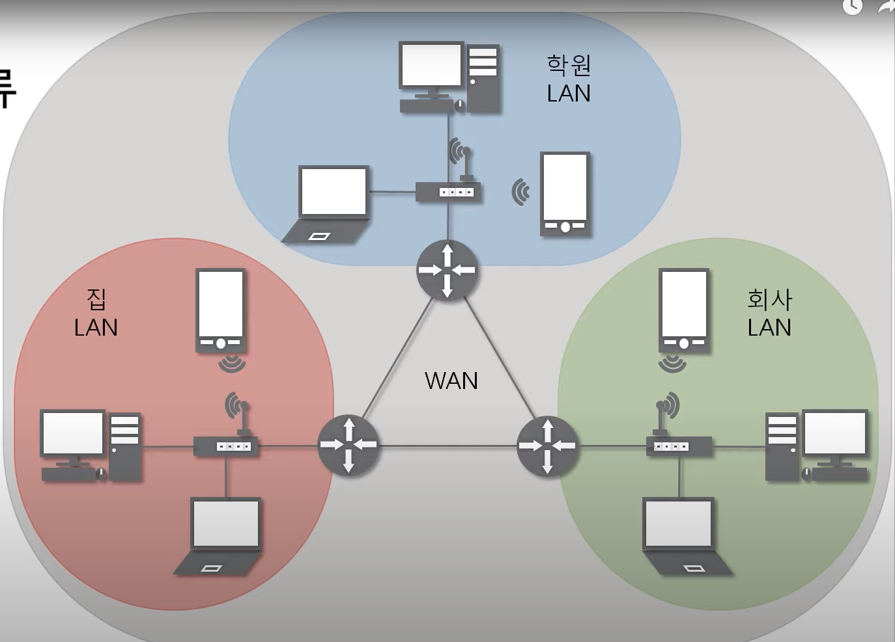
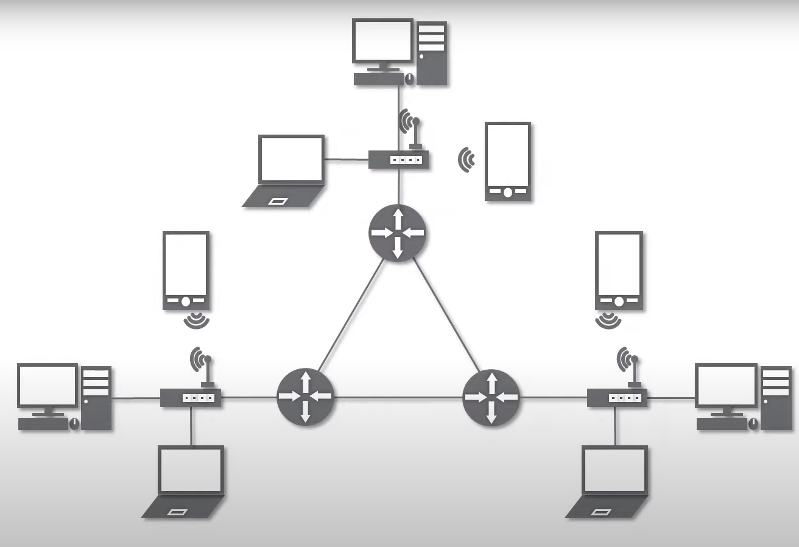

## 네트워크
 : 노드들이 데이터를 공유할 수 있게 하는 디지털 전기통신망의 하나

## 인터넷
 : 문서, 그림 영상과 같은 여러가지 데이터를 공유하도록 구성된 세상에서 가장 큰 네트워크

## 네트워크의 분류
### 1. 크기에 따른 분류
 * **LAN**(Local Area Network) : 가까운 지역을 하나로 묶은 네트워크(**근거리 통신망**)
 * **WAN**(Wide Area Network) : 멀리 있는 지역을 한데 묶은 네트워크 (가까운 지역끼리 묶인 LAN과 LAN을 다시 하나로 묶은 것)
 ()
 * MAN(Metropolitan Area Network)
 * 기타(VLAN, CAN, PAN 등등)  
 
### 2. 연결 형태에 따른 분류
 * **Star형**(중앙 장비에 모든 노드가 연결) : ex) 가정집의 공유기
 * **Mesh형**(여러 노드들이 서로 그물처럼 연결)
 * Tree형(나무의 가지처럼 계층구조로 연결)
 * 기타(링형, 버스형, 혼합형 등등)

 *혼합형*(실제 인터넷은 여러 형태를 혼합한 형태)
 ()

 ## 네트워크의 통신방식
 1. 유니 캐스트 - 특정 대상이랑만 1:1로 통신
 2. 멀티 캐스트 - 특정 다수와 1:N으로 통신
 3. 브로드 캐스트 - 네트워크에 있는 모든 대상과 통신

 ## 네트워크 프로토콜
네트워크에서 노드와 노드가 통신할 때 어떤 노드가 어느 노드에게 어떤 데이터를 어떻게 보내는지 작성하기 위한 양식

### 여러가지 프로토콜
* 가까운 곳과 연락할 때 : Ethernet 프로토콜 (MAC 주소)
* 멀리 있는 곳과 연락할 때 : ICMP, IPv4, ARP (IP 주소)
* 여러가지 프로그램으로 연락할 때 : TCP, UDP (포트 번호)

> 데이터를 보내기 위해 어떤 프로그램과 통신할지(TCP), 어느 지역에 있는 컴퓨터인지(IPv4), 그 지역에서 특정 컴퓨터를 찾아간다(Ethernet) : **패킷(여러 프로토콜로 캡슐화)** 

<!-- 실습 -->
