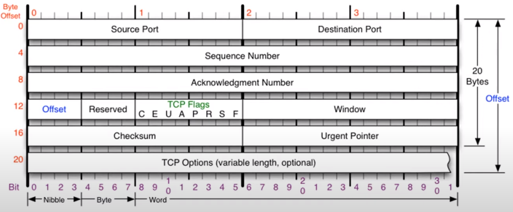

# TCP 프로토콜
### TCP가 하는 일
- 전송 제어 프로토콜(Transmission Control Protocol, TCP)은 인터넷에 연결된 컴퓨터에서 실행되는 프로그램 간에 통신을 안정적으로, 순서대로, 에러없이 교환할 수 있게 한다.
- TCP의 안정성을 필요로 하지 않는 애플리케이션의 경우 일반적으로 TCP 대신 비접속형 사용자 데이터그램 프로토콜(User Datagram Protocol)을 사용한다.
- TCP는 UDP보다 안전하지만 느리다.

### TCP 프로토콜의 구조

#### TCP 플래그
C E **U(긴급비트) A(승인비트) P(밀어넣기비트) R(초기화비트) S(동기화비트) F(종료비트)**

Urgent : 긴급bit\
Acknowledgment : 승인bit\
Push: 밀어넣기bit\
Reset: 초기화bit\
Syn: 동기화bit\
Fin: 종료bit

`중요한 플래그 : A R S F`

# TCP 연결 수립 과정
- TCP를 이용한 데이터 통신을 할 때 프로세스와 프로세스를 연결하기 위해 가장 먼저 수행되는 과정

>1. 클라이언트가 서버에게 요청 패킷을 보낸다.
>1. 서버가 클라이언트의 요청을 받아들이는 패킷을 보낸다.
>1. 클라이언트는 이를 최종적으로 수락하는 패킷을 보낸다.
- 위의 3개의 과정을 3Way Handshake라고 부른다.

1. Flag : SYN(동기화비트)\
    S:100 A:0
1. Flag : SYN(동기화비트) + ACK(승인비트)\
    S:2000 A:101
1. Flag : ACK(승인비트)\
    S:101 A:2001