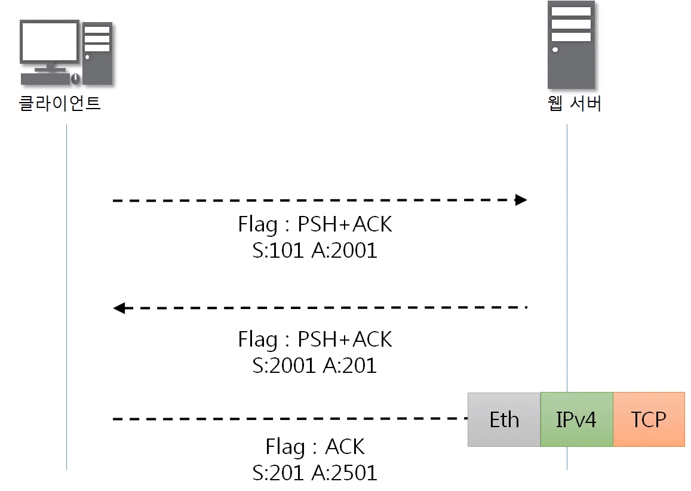
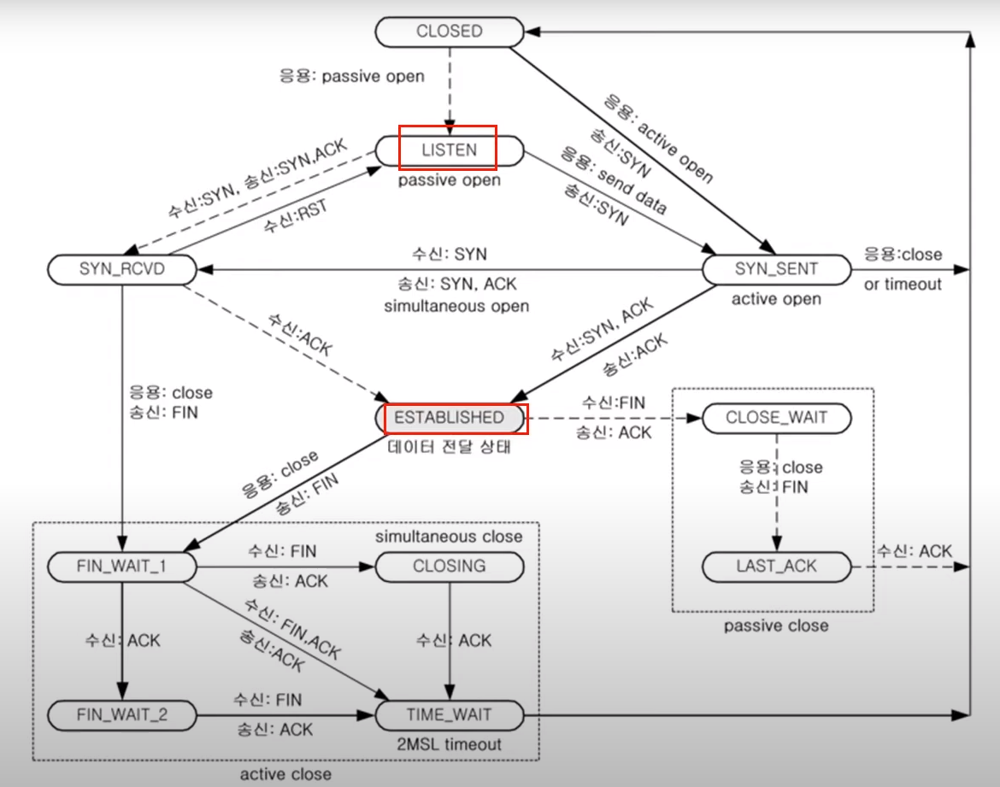

# TCP를 이용한 통신과정
### 데이터 송수신 과정
> TCP를 이용한 데이터 통신을 할 때 단순히 TCP 패킷만을 캡슐화해서 통신하는 것이 아닌 페이로드를 포함한 패킷을 주고 받을 때의 일정한 규칙
1. 보낸 쪽에서 또 보낼 때는 SEQ번호와 ACK번호가 그대로다.
2. 받는 쪽에서 SEQ번호는 받은 ACK번호가 된다.
3. 받는 쪽에서 ACK번호는 받은 SEQ번호 + 데이터의 크기

# TCP 상태전이도

**Listen** : 포트 번호를 열어놓고 있는 상태(포트 번호 사용 중인 상태)\
**Established** : 서로 연결이 수립된 상태 

순서 : LISTENING -> SYN_RECEIVED -> ESTABLISHED

ex)
3 way-handshake 이 후 클라이언트의 요청

Sequence number : 527792041\
Acknowledgment number : 953507065\
966 GET = Ethernet + IPv4 + TCP + Data\
Data = 966 - (14 + 20 + 20) = 912

클라이언트의 요청으로 서버가 클라이언트에게 다시 보낸다.

Sequence number : 953507065\
Acknowledgment number : 527792953\
DATA