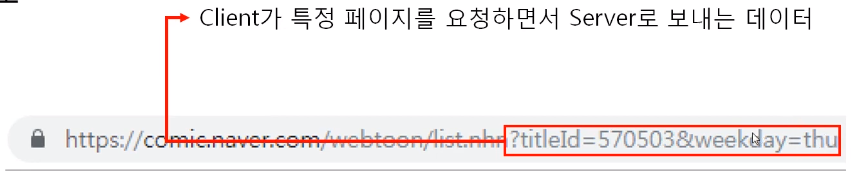
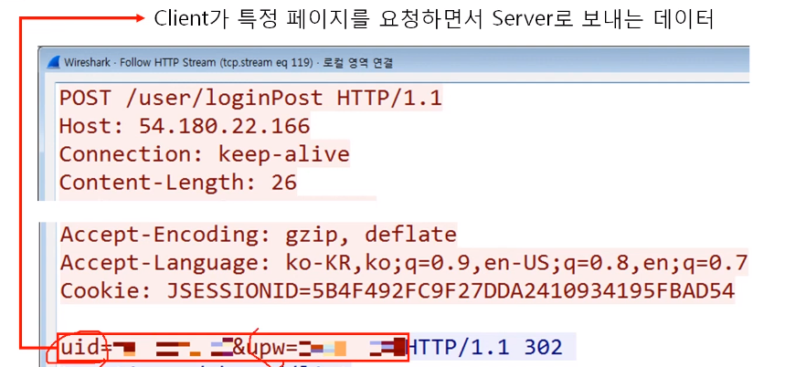

# HTTP 요청 프로토콜
- Request Line 
- Headers 
- 공백 
- Body

Request Line\
: **요청 타입** + 공백 + **URI** + 공백 + HTTP 버전

### HTTP 요청 방식
1. GET : Client가 Server로부터 문서를 읽어오려 할 때 사용(중요하지 않은 데이터)

1. POST : Client가 Server에게 어떤 정보를 전송할 때 사용(중요한 데이터, ID-PW)
