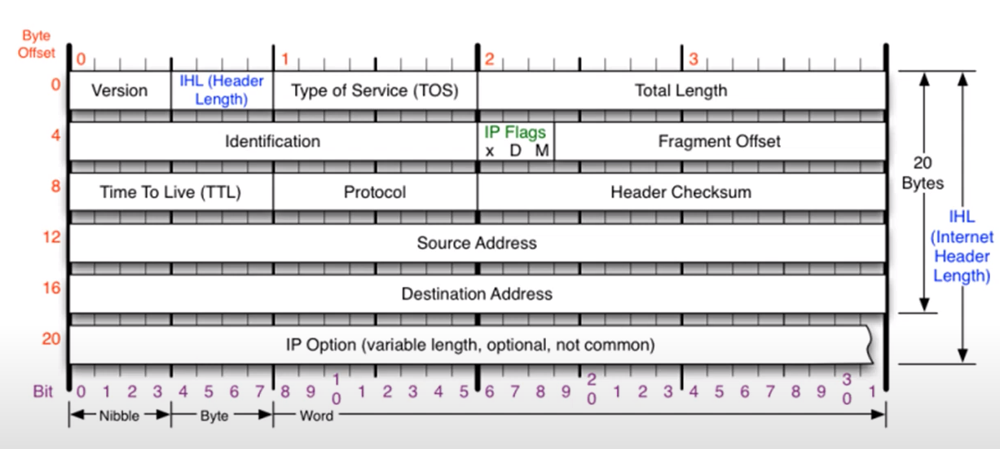
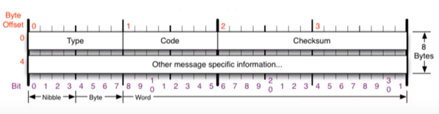

# IPv4
- 네트워크 상에서 데이터를 교환하기 위한 프로토콜
- 데이터가 **정확하게 전달될 것을 보장하지 않는다.**
- 중복된 패킷을 전달하거나 패킷의 순서를 잘못 전달할 가능성도 있다. (악의적으로 이용되면 DoS 공격이 됨)
- 데이터의 정확하고 순차적인 전달은 그보다 상위 프로토콜인 TCP에서 보장한다.

## IPv4 프로토콜(20Byte)

- **version** : 4 (6는 구조가 달라서 4만 들어간다.)
- **header length** : 20~60 / 4 한 값이 들어간다.
- **Total length** : 페이로드 데이터의 길이까지
- **Identification** : 조각화 한 경우 같은 묶음끼리 알아볼 수 있는 id
- **Flags** : 조각화 한 경우 더 들어올 데이터가 있는 경우 1, 없는 경우 0
- **Fragment Offset** : 조각화 한 경우 데이터의 처음 값으로부터 얼마나 떨어져있는지
- **Time to live** : 운영체제마다 값이 다름(window 128. linux 64) 네트워크 장비 하나씩 돌아다닐 때마다 1씩 감소
- **Protocol** : 상위 프로토콜(ICMP:0x01, TCP:0x06, UDP:0x11)
- **Header checksum** : header 계산
- **Source Address** : 출발지 IP 주소
- **Destinatinon Address** : 목적지 IP 주소

# ICMP(Internet Control Message Protocol)
네트워크 컴퓨터 위에서 돌아가는 운영체제에서 **오류 메시지**를 전송 받는 데 주로 쓰인다.\
프로토콜 구조의 Type과 Code를 통해 오류 메시지를 전송 받는다.

## ICMP 프로토콜 (8Byte, 특정 대상과 내가 통신이 잘 되는지 확인)

#### Type 
- 0 or 8 : 응답과 요청
- 3 or 11 : Destintnation unreachable(내 문제), Time exceded(상대 문제)
- 5 : 보안 상 알아두면 좋은 거