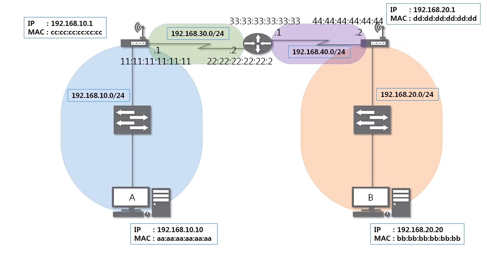
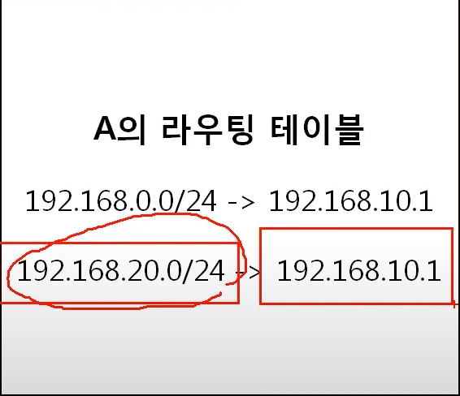

# 라우팅 테이블
어디로 보내야 하는지 설정되어있다.

>라우팅 테이블 확인 후 전송 과정
>1. 192.168.20.0/24가 있는 곳으로 가려면 192.168.10.1(cc:cc:cc:cc:cc:cc)로 가야한다.
>1. 192.168.20.0/24가 있는 곳으로 가려면 192.168.30.2(22:22:22:22:22:22)로 가야한다.
>1. 192.168.20.0/24가 있는 곳으로 가려면 192.168.20.1(44:44:44:44:44:44)로 갸야한다.
>1. 그 후에 bb:bb:bb:bb:bb:bb로 ICMP가 요청된다.