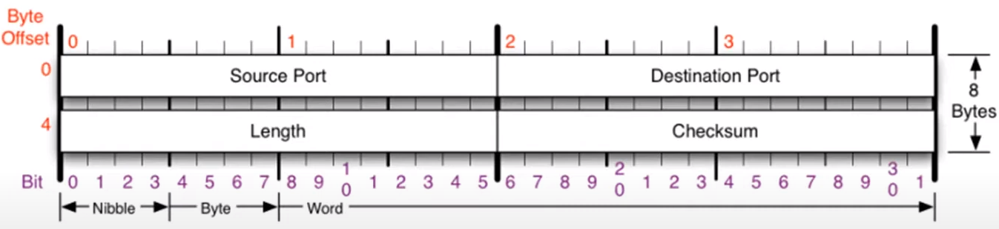

# 4계층 프로토콜

### 4계층에서 하는 일
- 전송 계층(Transport layer)은 송신자의 **프로세스와 수신자의 프로세스를 연결**하는 통신 서비스를 제공한다.
- 전송 계층은 연결 지향 데이터 스트림 지원, 신뢰성, 흐름 제어, 그리고 다중화와 같은 편리한 서비스를 제공한다.
- 전송 프토토콜 중 가장 잘 알려진 것은 연결 지향 전송 방식을 사용하는 전송 제어 프로토콜(TCP)이다. 보다 단순한 전송에 사용되는 사용자 데이터 그램 프로토콜(UDP)도 있다.

### 4계층 프로토콜의 종류
1. TCP (연결지향형 프로토콜)

1. UDP (비연결지향형 프로토콜)

# 포트 번호

### 포트 번호의 특징
- 특정 프로세스와 특정 프로세스가 통신을 하기 위해 사용한다.
- 하나의 포트는 하나의 프로세스만 사용 가능하다.
- 하나의 프로세스가 여러 개의 포트를 사용하는 것은 가능하다.
- 포트 번호는 일반적으로 정해져 있지만 무조건 지켜야 하는 것은 아니다.
- 예를 들어 일반적으로 웹 서비스는 80번 포트를 사용하지만 웹 서비스가 항상 80번 포트를 사용해야만 하는 것은 아니다.

### Well-known(잘 알려진) 포트번호
|서비스 이름|포트 번호|
|--|--|
|FTP|20,21|
|SSH|22|
|TELNET|23|
|DNS|53|
|DHCP|67,68|
|TFTP|69|
|**HTTP**|80|
|**HTTPS**|443|

